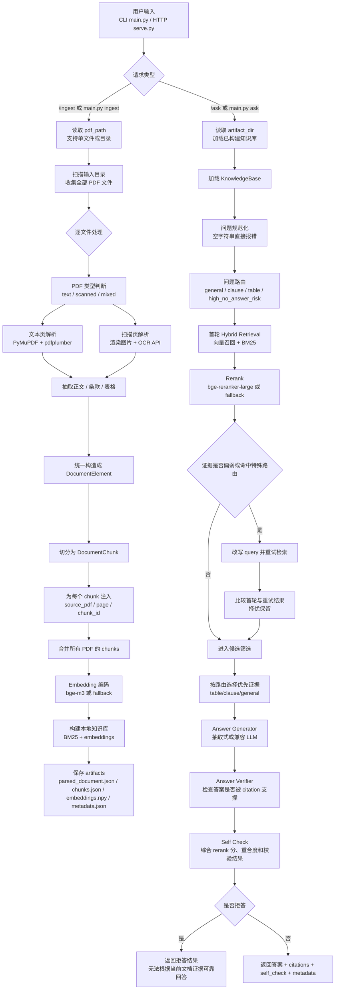
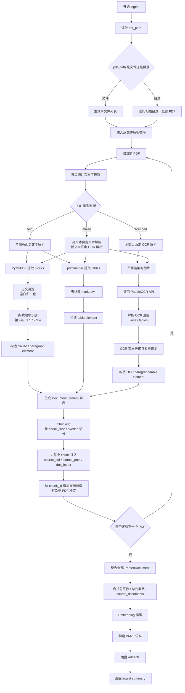
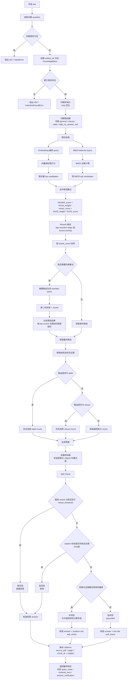
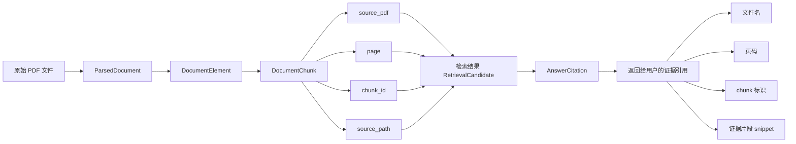

# 智能文档问答 Agent 流程与架构说明

本文档用于单独说明当前项目的执行链路、模块职责、关键取舍和运行状态流，方便你在提交作业、录制演示视频或面试讲解时直接使用。

文档重点回答四个问题：

- 系统是如何从多个 PDF 进入统一知识库的。
- 文本型 PDF、扫描型 PDF、混合型 PDF 分别怎么处理。
- 问答时是如何完成问题路由、召回、重排、检索重试、回答、证据校验、自检和拒答的。
- 为什么这套实现可以被定义为“生产风格最小 Demo”。

## 1. 总体说明

当前系统支持两种输入方式：

- 传入单个 PDF 文件路径。
- 传入一个目录路径，自动读取目录下全部 PDF 文件，并统一构建一个检索库。

系统主流程分成两段：

1. Ingest 阶段：解析 PDF，抽取正文、条款、表格，切分 chunk，生成向量并保存 artifacts。
2. Ask 阶段：加载 artifacts，做问题路由，执行检索和必要的检索重试，生成答案，完成证据校验、自检与拒答，输出 citation 和状态元数据。

## 2. 系统总览图

## 3. Ingest 详细流程图

这一部分对应代码中的核心链路：

- `DocumentQaAgent.build_index`
- `resolve_pdf_inputs`
- `parse_documents`
- `parse_document`
- `KnowledgeBase.build`

## 4. 问答阶段详细流程图

这一部分对应代码中的核心链路：

- `DocumentQaAgent.ask`
- `route_question`
- `KnowledgeBase.search`
- `AnswerGenerator.generate`
- `verify_answer_support`
- `run_self_check`

## 5. 引用与可追溯性流程图

多 PDF 输入时，最容易出问题的地方不是“能不能检索”，而是“引用是否还能说清楚来自哪个文件、哪一页、哪一个 chunk”。当前系统通过 `source_pdf` 和 `chunk_id` 解决这个问题。

## 6. 关键模块职责映射

### 6.1 入口层

- `main.py`
  - CLI 启动入口。
- `serve.py`
  - HTTP 启动入口。
- `src/docqa_agent/api.py`
  - FastAPI 路由定义和错误映射。

### 6.2 编排层

- `src/docqa_agent/agent.py`
  - 统一编排 ingest 和 ask。
  - 管理 KnowledgeBase 缓存。
  - 执行问题路由、检索重试、证据校验，并汇总 citations 和 metadata。

### 6.3 解析层

- `src/docqa_agent/parsers/classifier.py`
  - 判断 PDF 类型。
- `src/docqa_agent/parsers/text_pdf.py`
  - 文本 PDF 解析。
- `src/docqa_agent/parsers/scanned_pdf.py`
  - 扫描 PDF OCR 解析。
- `src/docqa_agent/services/ocr_client.py`
  - 对接 OCR API。

### 6.4 检索层

- `src/docqa_agent/chunking.py`
  - 负责分块与 chunk 标识生成。
- `src/docqa_agent/retrieval/embeddings.py`
  - 负责 embedding 编码。
- `src/docqa_agent/retrieval/store.py`
  - 管理 BM25、embedding 矩阵和检索逻辑。
- `src/docqa_agent/retrieval/reranker.py`
  - 管理 rerank。

### 6.5 生成与校验层

- `src/docqa_agent/services/query_router.py`
  - 问题路由、query rewrite、检索重试判定。
- `src/docqa_agent/services/generator.py`
  - 答案生成。
- `src/docqa_agent/services/answer_verifier.py`
  - 答案与 citation 支撑关系校验。
- `src/docqa_agent/services/self_check.py`
  - 综合 rerank 分、答案重合度、证据校验结果做自检、风险判断和拒答。

## 7. 关键设计取舍

### 7.1 为什么支持多 PDF 合并 ingest

因为你已经明确希望 `data/input` 能放多个文件，并在一次 ingest 中统一处理。这更接近真实业务场景：一个客户项目往往不是单个 PDF，而是一组合同、制度、说明书、报价单。

当前实现采取的是“同一个 artifact_dir 对应一个聚合知识库”的方式，优点是：

- 结构简单，适合作业演示。
- 多个 PDF 可直接交叉召回。
- 不需要引入额外数据库即可完成多文档检索。

代价也很明确：

- 当前还没有 doc-level filter。
- 还没有按文档单独增量更新。
- 多文档规模继续扩大后，应升级为独立向量存储和 metadata filter。

### 7.2 为什么 OCR 只通过 API 接入

你的目标路线已经明确是 PaddleOCR API，这样的好处是：

- OCR 计算和主应用解耦。
- 更容易替换为云端或单独服务进程。
- 主项目安装依赖更轻。

### 7.3 为什么先用规则化自检

作业场景下，规则化自检比“黑盒 judge”更容易解释和验证：

- 面试时更容易讲清楚为什么拒答。
- 更利于回归测试。
- 可以逐步升级，不会推翻现有主流程。

### 7.4 为什么增加问题路由、检索重试和证据校验

这三步的目标不是让系统“更复杂”，而是让它更像一个真正的文档 QA Agent：

- 问题路由：让系统先判断当前问题更像条款问答、表格问答还是高风险无答案问题，而不是所有问题都走完全相同的路径。
- 检索重试：首轮证据不足时，不直接把失败交给生成器，而是先尝试改写 query 再检索一次。
- 证据校验：答案生成后不立即返回，而是再检查答案是否真的被 citation 支撑。

这三步共同提升了两个方面：

- 可解释性：你可以说明系统为什么选这类证据，为什么重试，为什么拒答。
- 稳健性：对表格问题、条款问题和无答案问题的处理更保守。

## 8. 适合在演示时重点强调的三个点

1. 目录下多个 PDF 会被统一 ingest，并在回答时返回来源文件名和页码。
2. 系统不是直接问 LLM，而是先做问题路由、检索、必要的检索重试、回答和证据校验。
3. 对无答案问题不会硬答，而是会在高风险路由和证据校验不足时进入拒答路径。

## 9. 后续可以继续扩展的流程节点

如果你后续还要继续完善，这几个节点最值得扩展：

- 在 ingest 后追加文档级元数据索引，例如 `doc_type`、`customer_id`、`biz_line`。
- 在 ask 阶段把当前规则化路由升级成模型化 query classification。
- 在证据校验阶段追加 LLM judge 或结构化字段一致性校验。
- 在 retrieval 后增加 table-only 路由，对数值问答优先检索表格。
